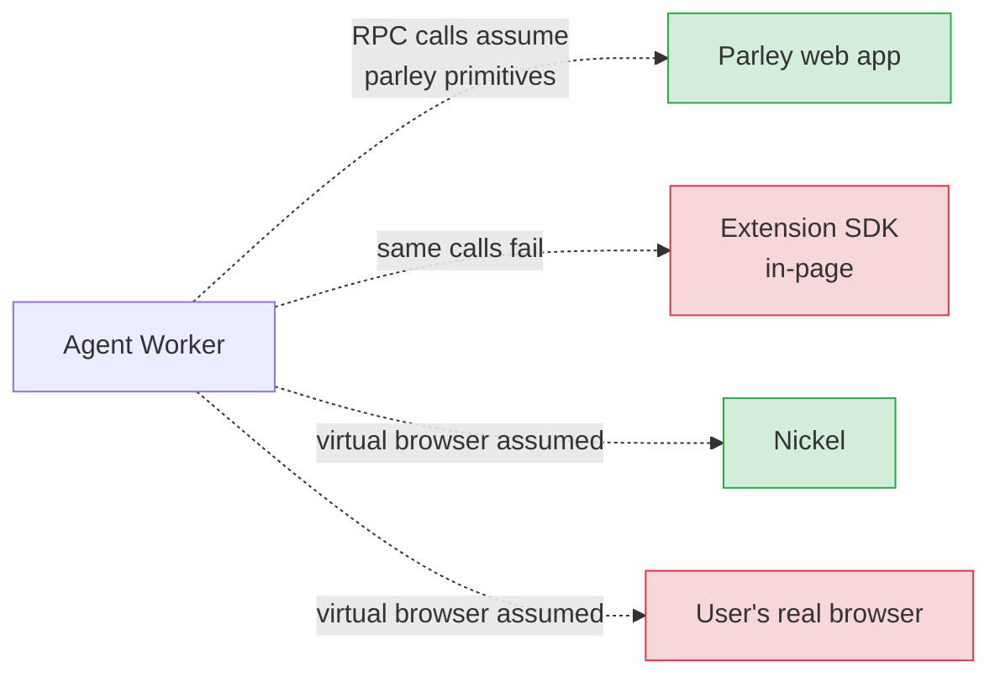
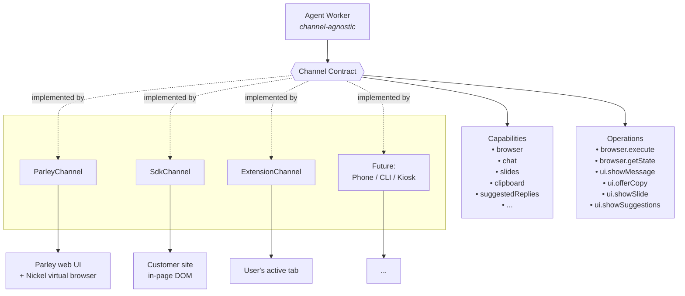

# Agent ↔ Channel decoupling

**Status:** Concern / RFC
**Date:** 2026-04-08

## Problem

The agent runtime today is tightly coupled to assumptions made by the
**parley web UI**: it hardcodes tool calls like `switchView`, `showSlide`,
`sendToolMessage`, `showSuggestedReplies`, `highlightHangup`, …, and assumes
the browser it drives is always **Nickel** (a server-side virtual browser).

These assumptions leak into every channel we try to bring up beyond parley.
The moment we introduced a second channel — the `@sable-ai/sdk-core` running
inside the user's real page via a browser extension — everything broke:

- The SDK doesn't have a chat bubble overlay. Agents calling
  `sendToolMessage` got `ToolError: Method not supported at destination`.
- The SDK doesn't have slides or call controls. Same `ToolError` cascade.
- The browser the agent wanted to drive wasn't Nickel — it was the user's
  actual tab. The agent still expected a Nickel-style endpoint.

Our short-term fix was to register 20 no-op stubs on the SDK side and add
a channel-side bridge selector (`nickel` vs `user`). That unblocks the
work, but the underlying coupling is still there: every new channel
(SDK, extension, phone, CLI, embedded kiosk, …) will pay the same "stub
everything parley assumes" tax, and the agent has no principled way to
discover what the channel actually supports.

## Today — tight coupling



Green = works today. Red = broken or needs per-channel special-casing.

## Proposal — channel facade

The agent should know **the contract**, not **the implementation**. A
`Channel` abstraction sits between the agent and whatever end-surface the
session is bound to. Each channel declares its capabilities and implements
a small, stable set of operations. The agent filters its tool palette
based on capabilities and calls operations through the facade — it never
references a parley-specific RPC name directly.



## What each channel declares

| Capability        | Parley | SDK (in-page) | Extension | Phone |
|-------------------|:-:|:-:|:-:|:-:|
| `browser`         | ✓ (Nickel) | ✓ (customer page) | ✓ (user tab) | ✗ |
| `chat`            | ✓ | ✗ (headless) | ✗ (headless) | ✗ |
| `slides`          | ✓ | ✗ | ✗ | ✗ |
| `suggestedReplies`| ✓ | ✗ | ✗ | ✗ |
| `clipboard`       | ✗ (has chat) | ✓ | ✓ | ✗ |
| `visibleControls` | ✓ | ✗ | ✗ | ✗ |
| `voice`           | ✓ | ✓ | ✓ | ✓ |

The agent's tool palette is derived from this table **at session start**.
An agent running in the SDK channel never sees `show_slide` in its tool
list, so it can't call it, so it can't fail calling it. No stubs needed.

## What the facade looks like (sketch)

```python
# agent side
class Channel(Protocol):
    def capabilities(self) -> set[str]: ...

    # Browser ops — present iff "browser" in capabilities()
    async def browser_execute(self, action: Action) -> None: ...
    async def browser_state(self) -> DomState: ...

    # UI ops — individually gated
    async def ui_show_message(self, text: str) -> None: ...
    async def ui_offer_copy(self, text: str) -> None: ...
    async def ui_show_slide(self, url: str) -> None: ...
    # ...

def build_tools(channel: Channel) -> list[Tool]:
    tools = [voice_tools()]  # everyone has voice
    if "browser" in channel.capabilities():
        tools += browser_tools(channel)
    if "chat" in channel.capabilities():
        tools += chat_tools(channel)
    if "slides" in channel.capabilities():
        tools += slide_tools(channel)
    if "clipboard" in channel.capabilities():
        tools += clipboard_tools(channel)
    return tools
```

Each channel implementation:

- `ParleyChannel` — declares everything, wires each op to the corresponding
  parley LiveKit RPC. Basically the current behaviour, renamed.
- `SdkChannel` — declares `browser`, `clipboard`, `voice`. `browser_*`
  maps to the 6 `browser.*` RPCs the SDK already serves. `ui_offer_copy`
  maps to `navigator.clipboard.writeText` via the RPC we already wrote.
  The chat/slides/controls ops simply don't exist — the agent's tool
  builder never adds tools that would call them.
- `ExtensionChannel` — inherits from `SdkChannel` and adds extension-only
  goodies (e.g. tab capture, cross-origin screenshots).
- `PhoneChannel` — declares only `voice`.

## Why this is a good shape

1. **No stub sprawl.** Today each new channel means 20 no-op RPC handlers
   to keep the agent happy. With the facade, missing capabilities simply
   remove tools from the palette; there's nothing to stub.
2. **Agent stays single-source.** Same agent codebase, same YAML, same
   system prompt. No "SDK-flavoured agent" vs "parley-flavoured agent".
3. **Channels evolve independently.** Adding a `kiosk` channel doesn't
   touch parley or the SDK. Adding a new UI primitive (say,
   `ui.show_confirmation_modal`) only affects the channels that can
   implement it — others just don't expose the tool.
4. **Vision/browser becomes a per-channel concern.** The channel owns
   its own frame source. Parley channel → Nickel WebRTC. SDK channel →
   canvas captureStream from in-page wireframe + DOM metadata. No more
   runtime branching in `component_factory.py`.
5. **Testing is easier.** A `FakeChannel` that declares the capabilities
   you want and records the ops you called is sufficient to test agent
   behaviour.

## Migration shape (non-prescriptive)

1. Define the `Channel` protocol in agentkit, matching the current tool
   set 1:1.
2. Wrap the existing parley RPC calls behind `ParleyChannel`. No
   behavioural change — just a rename.
3. Introduce `SdkChannel` that declares `{browser, clipboard, voice}`
   and drops the 20 stubs on the SDK side.
4. Move browser/vision wiring out of `component_factory.py` and into
   `channel.setup(room)` — each channel owns its own frame source and
   bridge.
5. Audit every existing tool. If it's channel-specific, attach it to a
   capability. If it's genuinely universal, leave it at the top level.

---

**Next step on the current branch:** unrelated to this RFC, implementing
the vision upgrade (canvas captureStream video track + visible-dom
metadata sidecar for the user-bridge path). That work lives inside what
would become `SdkChannel.browser`, so it doesn't block this refactor —
it's a concrete thing we can lift into the facade later without rework.
